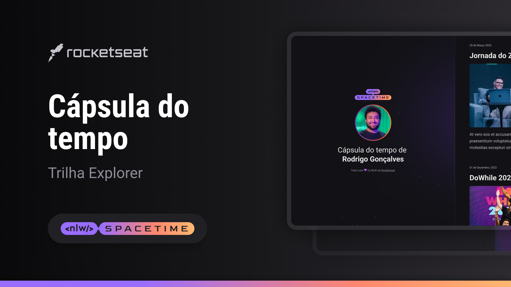

<h1 align="center">NLW Spacetime - Cápsula do tempo </h1>

Registrando momentos especiais de nossa vida!! 📸🥳

  

 

  <a href="#-Progresso">Progresso</a>&nbsp;&nbsp;&nbsp;|&nbsp;&nbsp;&nbsp;
  <a href="#-Objetivo">Objetivo</a>&nbsp;&nbsp;&nbsp;|&nbsp;&nbsp;&nbsp;
  <a href="#-Tecnologias">Tecnologias</a>&nbsp;&nbsp;&nbsp;|&nbsp;&nbsp;&nbsp;
  <a href="#-Projeto">Projeto</a>
  &nbsp;&nbsp;&nbsp;|&nbsp;&nbsp;&nbsp;
  <a href="#-Layout">Layout</a>

 

 

## 🗓️ Progresso

  <table>
    <tr align="center">
      <th>🚩 INICIADO</th>
      <th>✅ FINALIZADO</th>
    </tr>
    <tr align="center">
      <td>15/05/2023</td>
      <td>21/05/2023</td>
    </tr>
  </table>

 

## 🎯 Objetivo

> Realizar a construção de um página que registre momentos especiais da vida e que estejam relacionados ao nosso progresso na programação ou outras áreas. O registro consiste na data, imagem e pequena descrição da experiência.

 

## 🚀 Tecnologias

- HTML5 e CSS3
- Git e Github
- Figma

 

## 💻 Deploy

- Acesse o projeto finalizado aqui -> [🏆](https://pedro-suassuna.github.io/NLW_Spacetime_TimeCapsule_Rocketseat)

 

## 🔖 Layout

Acesse o Layout base para o projeto aqui -> [🎨](<https://www.figma.com/file/953WGJODmN1BTMI3fsW72x/Stage-05---Dark-Mode-FocusTimer-(Copy)?type=design&node-id=0-8&t=0ARDZKJ5OJCXFaMq-0>).
 

- OBS: É necessário ter conta no [Figma](https://figma.com) para acessá-lo.
